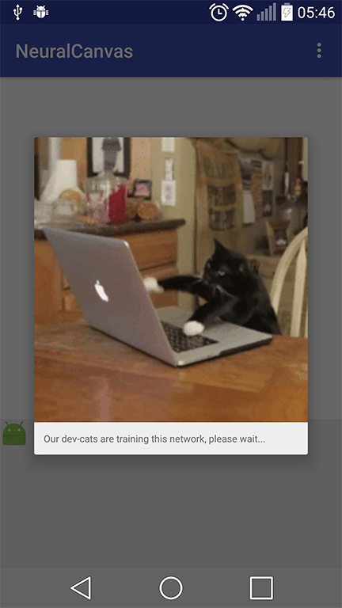

# NeuralCanvas
> Android project for digit recognition using multilayer perceptron with backpropagation

A simple digit recognition app using neural network, adapted from [this project](http://www.android-examples.com/android-simple-draw-canvas-finger-example-tutorial/).

## Release History

* 0.0.1
    * First release for the [Monitora](http://monitoratec.com.br/) company training intern program

## Author

[My Linkedin](https://www.linkedin.com/in/gustavo-carvalho-tremiliosi/)

[My github profile](https://github.com/gugact)

## Contributing

1. Fork it (<https://github.com/gugact/NeuralCanvas/fork>)
2. Create your feature branch (`git checkout -b feature/fooBar`)
3. Commit your changes (`git commit -am 'Add some fooBar'`)
4. Push to the branch (`git push origin feature/fooBar`)
5. Create a new Pull Request

